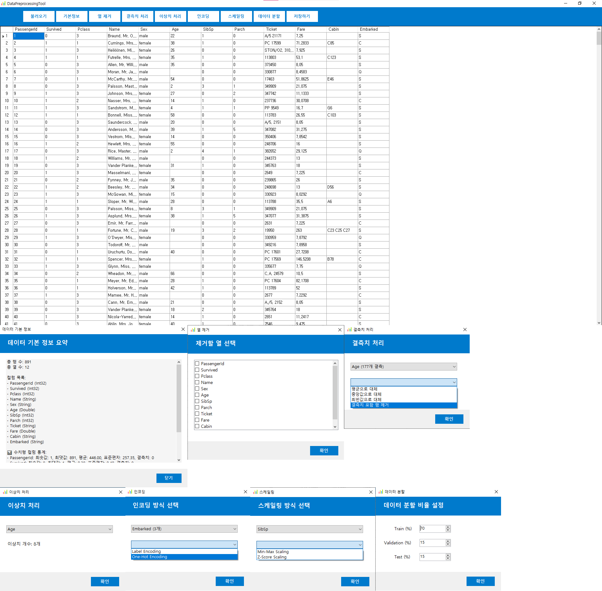

# 데이터 전처리 도구 (C# WinForms)

데이터 분석 및 머신러닝을 위한 전처리 과정을 직관적 UI로 쉽게 처리할 수 있도록 제작된 Windows Forms 기반의 데스크톱 애플리케이션입니다.

---
## 🛠 개발 기간
- 2025년 5월 / 총 2주일

## 🧑개발 인원
- 1명

---  
## ⚙️ 개발환경 및 사용 패키지

- **개발 언어**: C#
- **플랫폼**: .NET Framework (Windows Forms)
- **IDE**: Visual Studio

- **CsvHelper**  
  CSV 파일 로딩 및 저장  
  👉 https://www.nuget.org/packages/CsvHelper

- **EPPlus**  
  Excel(.xlsx) 파일 읽기/쓰기  
  👉 https://www.nuget.org/packages/EPPlus

- **MathNet.Numerics**  
  평균, 표준편차, IQR 등 통계 계산  
  👉 https://www.nuget.org/packages/MathNet.Numerics
  
---
## ▶️ 실행 방법
📦 [다운로드]([https://github.com/kmh8405/CaptureTranslator/releases/download/v1.0/CaptureTranslatorApp.zip](https://github.com/user-attachments/files/20218098/Release.zip)) (압축 해제 후  파일 실행) 또는
1. Visual Studio에서 `DataPreprocessingTool.sln` 열기
2. `F5` 또는 `디버깅 없이 시작(Ctrl+F5)`로 실행
3. 상단 버튼을 통해 기능 사용


---
## 🔧 주요 기능

| 기능 | 설명 |
|------|------|
|  파일 불러오기 | Excel(.xlsx), CSV(.csv) 파일을 DataGridView에 로드 |
|  기본 정보 요약 | 컬럼 수, 결측치 수, 데이터 타입 등 자동 요약 |
|  열 제거 | 선택한 컬럼 제거 |
|  결측치 처리 | 평균, 중앙값, 최빈값 대체 또는 삭제 방식 선택 |
|  이상치 처리 | IQR 방식으로 이상치 탐지 및 제거 |
|  인코딩 | Label Encoding, One-Hot Encoding |
|  스케일링 | Min-Max, Z-Score 방식 선택 |
|  데이터 분할 | 학습/검증/테스트 비율 설정 후 분할 |
|  저장하기 | 전처리된 데이터를 저장 가능 (CSV/Excel) |
---

## 📂 프로젝트 구조

```
/DataPreprocessingTool
├── Forms
│   ├── MainForm.cs
│   ├── ColumnRemoveForm.cs
│   ├── MissingValueForm.cs
│   ├── OutlierForm.cs
│   ├── EncodingForm.cs
│   ├── ScalingForm.cs
│   ├── SplitForm.cs
│   └── InfoForm.cs
│
├── FileLoader
│   ├── DataSaver.cs
│   ├── CsvFileLoader.cs
│   └── ExcelFileLoader.cs
│
├── Program.cs
└── DataPreprocessingTool.csproj
```
---
## 🖼️ 화면 예시




